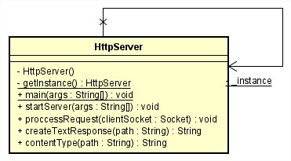

## TALLER CLIENTES Y SERVICIOS
### Miguel Ángel Rodríguez Siachoque
### 7 de Septiembre de 2021

## Ejecución de programas
- Los programas ___HttpServer, URLComponents y URLBrowser___ no necesitan ejecutar un ___Server___ para su funcionamiento.
- Todos los programas exceptuando los anteriores nombrados, necesitan ejecutarse:
  1. Ejecutar ___Server___ que quiere ejecutar.
  2. Ejecutar ___Cliente___ para poder ingresar entradas.
  3. Escribir entradas segun correspondan (Se explica a continuación).
- El programa ___Client___ solamente se ejecuta, las entradas que se ingresan depende del servidor activado.

### Descripción de URLComponents.java
Este programa lee una URL a la cual se podra extraer y mostrar los protocolos de esta, en total 8 protocolos ___(getProtocol, getAuthority, getHost, getPort, getPath, getQuery, getFile, getRef)___
#### Diagrama URLComponents.java
 
Este diagrama esta en el paquete ___edu.escuelaing.arem.URLComponents___ con una clase, pues es de ejcución unica.
#### Ejecución
> 1. Ejecución del programa.
> 2. La entrada debe ser una ___URL___.
> 3. La salida serán los 8 protocolos de la URL.

### Descripción de URLBrowser.java
Este programa lee el contenido de la ___URL___ y lo extrae archivando la información en un archivo con extensión ___.html___ .
#### Diagrama URLBrowser.java
 
Este diagrama esta en el paquete ___edu.escuelaing.arem.AppBrowser___ con una clase, pues es de ejcución unica.
#### Ejecución
> 1. Ejecución del programa.
> 2. La entrada debe ser una ___URL___.
> 3. La salida será un mensaje que explicará si el proceso a terminado.
> 4. El archivo resultado.html se guardará en la carpeta principal del proyecto.

### Descripción de HttpServer.java
Este es un programa que ejecuta un ___servidor HTTP___ en el cual se podran ejecutar diferentes archivos dentro de este.
#### Diagrama HttpServer.java
 
Este diagrama esta en el paquete ___edu.escuelaing.arem.HttpServer___ con una clase, pues es de ejcución unica.
#### Ejecución
> 1. Ejecución del programa.
> 2. Ingresará en su buscador preferido y pondrá la dirección: http://127.0.0.1:35000/ + El archivo que quiere visualizar.

### Descripción de ClientServer.java
Este programa crea un cliente el cual interactua con el servidor activo en ese momento.
#### Diagrama ClientServer.java
 
Este diagrama esta en el paquete ___edu.escuelaing.arem.ClientServer___ con una clase, pues es de ejcución unica.
#### Ejecución
> 1. Ejecución del programa.
> 2. Ejecución del Servidor.
> 3. La entrada y salida dependerá de las entradas y salidas de los servidores activos.

### Descripción de Calculator.java
Este es un programa en el cual se da el resultado del ___cuadrado del número___ asigando.
#### Diagrama Calculator.java
 
Este diagrama esta en el paquete ___edu.escuelaing.arem.Calculator___ con una clase, aunque necesita la ejecución de ___EchoClient.java___ no tienen un atributo en común.
#### Ejecución
> 1. Ejecución del programa.
> 2. Ejecución de ___Client___.
> 3. La entrada puede ser un número ó terminar ___Server___ con ___"Bye."___.
> 4. La salida será el número cuadrado ó la despedida del servidor.

## Test
 
- Se realizarón cuatro pruebas con mediante al comando: ___mvn test.___ 
> - Se realizaron 3 Pruebas por programa.
> - Las pruebas de HttpServer se verifican entrando en http://127.0.0.1:35000/TestHttpServer1.html, http://127.0.0.1:35000/TestHttpServer2.html ó http://127.0.0.1:35000/TestHttpServer3.html .

## Artículo y Evaluación
[Artículo del Taller 2](Articulo-Taller2.pdf)

## JavaDoc:
[JavaDoc - ClienteServer](JavaDocs/index.html)